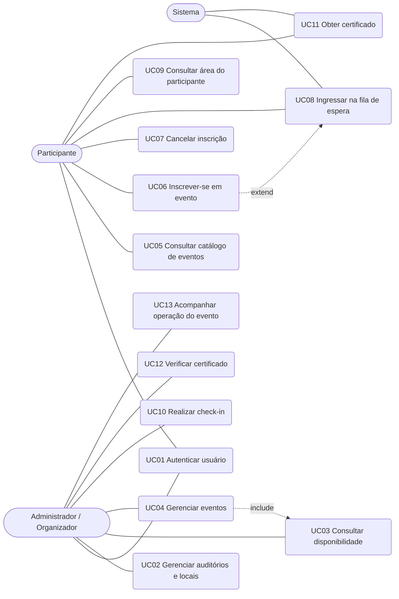

## 4. Casos de Uso

### 4.1 Atores

| Ator | Tipo | Descrição |
|---|---|---|
| Administrador / Organizador | Primário | Planeja espaços e eventos, realiza check-in e acompanha a operação. |
| Participante | Primário | Consulta eventos, inscreve-se, apresenta identificação de presença e obtém certificado. |
| Sistema | Secundário | Executa promoções automáticas da fila de espera e apoia a geração do certificado. |

*Tabela 2 — Atores do modelo de casos de uso.*

### 4.2 Diagrama de casos de uso

A Figura 1 apresenta o diagrama UML de casos de uso da solução. O relacionamento `<<include>>` indica que a gestão de eventos utiliza a consulta de disponibilidade para evitar conflito de agenda. O relacionamento `<<extend>>` indica que a inscrição pode ser estendida pela fila de espera quando não houver vaga. O ator Sistema participa da promoção automática da fila.

*Figura 1 — Diagrama de casos de uso do Sistema de Gestão de Eventos e Auditórios.*

### 4.3 Descrição dos casos de uso

Os casos de uso a seguir utilizam o formato de descrição textual (fluxo básico, alternativos e de exceção), adequado à disciplina de Análise e Desenvolvimento de Sistemas e alinhado ao template MackLEAPS/RUP.

#### UC01 — Autenticar usuário

| Campo | Conteúdo |
|---|---|
| Identificador | UC01 |
| Nome | Autenticar usuário |
| Ator principal | Administrador / Organizador; Participante |
| Atores secundários | — |
| Objetivo | Permitir acesso identificado ao sistema e carregar o perfil e as permissões correspondentes. |
| Pré-condições | O usuário possui credenciais cadastradas. |
| Pós-condições de sucesso | Sessão autenticada com perfil definido; operações administrativas permanecem restritas ao perfil autorizado. |
| Requisitos funcionais | RF01 |
| Regras de negócio | — |

**Fluxo básico**
1. O usuário acessa o sistema.
2. O usuário informa suas credenciais de identificação.
3. O sistema valida as credenciais.
4. O sistema identifica o perfil (Administrador/Organizador ou Participante).
5. O sistema apresenta a interface e as operações permitidas ao perfil.

**Fluxos alternativos**
- Não há fluxo alternativo de sucesso além da escolha de perfil já cadastrado.

**Fluxos de exceção**
- E1 — Credenciais inválidas: o sistema recusa o acesso e informa o motivo, sem revelar dados de outros usuários.
- E2 — Usuário autenticado como Participante tenta operação administrativa: o sistema bloqueia a operação (RF01).

#### UC02 — Gerenciar auditórios e locais

| Campo | Conteúdo |
|---|---|
| Identificador | UC02 |
| Nome | Gerenciar auditórios e locais |
| Ator principal | Administrador / Organizador |
| Atores secundários | — |
| Objetivo | Manter o cadastro dos espaços utilizados em eventos, incluindo capacidade, localização e bloqueios de agenda. |
| Pré-condições | O administrador está autenticado (UC01). |
| Pós-condições de sucesso | O local está cadastrado, atualizado, desativado ou com indisponibilidade registrada, conforme a operação realizada. |
| Requisitos funcionais | RF02 |
| Regras de negócio | RN01, RN02 |

**Fluxo básico**
1. O administrador solicita o cadastro de um local.
2. O administrador informa nome/identificação, capacidade e localização.
3. O sistema valida os dados obrigatórios.
4. O sistema registra o local.
5. O sistema confirma a operação.

**Fluxos alternativos**
- A1 — Consultar locais cadastrados.
- A2 — Alterar dados de um local existente.
- A3 — Desativar um local.
- A4 — Registrar indisponibilidade ou bloqueio de agenda para um período.

**Fluxos de exceção**
- E1 — Dados obrigatórios ausentes ou capacidade inválida: o sistema impede a gravação e solicita correção.

#### UC03 — Consultar disponibilidade de locais

| Campo | Conteúdo |
|---|---|
| Identificador | UC03 |
| Nome | Consultar disponibilidade de locais |
| Ator principal | Administrador / Organizador |
| Atores secundários | — |
| Objetivo | Identificar espaços livres e compatíveis com data, horário e capacidade necessária. |
| Pré-condições | Existem locais cadastrados (UC02). O administrador está autenticado. |
| Pós-condições de sucesso | O administrador obteve a lista de locais compatíveis ou a informação de que não há local disponível. |
| Requisitos funcionais | RF03 |
| Regras de negócio | RN01, RN02 |

**Fluxo básico**
1. O administrador informa data e intervalo de horário.
2. Opcionalmente, informa a capacidade mínima necessária para o público esperado.
3. O sistema pesquisa locais sem conflito de agenda no período (RN01).
4. Quando a capacidade é informada, o sistema descarta locais incompatíveis (RN02).
5. O sistema apresenta somente os locais compatíveis.

**Fluxos alternativos**
- A1 — Nenhum local atende aos critérios: o sistema informa claramente a indisponibilidade.

**Fluxos de exceção**
- E1 — Período inválido (término anterior ao início): o sistema recusa a consulta e solicita correção.

#### UC04 — Gerenciar eventos

| Campo | Conteúdo |
|---|---|
| Identificador | UC04 |
| Nome | Gerenciar eventos |
| Ator principal | Administrador / Organizador |
| Atores secundários | — |
| Objetivo | Criar, consultar, alterar e encerrar eventos, associando local e vagas sem conflito de agenda, inclusive com subeventos. |
| Pré-condições | O administrador está autenticado. Há pelo menos um local cadastrado. Este caso de uso inclui UC03 na escolha do espaço. |
| Pós-condições de sucesso | O evento é persistido com estado válido (aberto, lotado, encerrado ou realizado) e sem conflito de local/horário. |
| Requisitos funcionais | RF04 |
| Regras de negócio | RN01, RN02 |

**Fluxo básico**
1. O administrador solicita a criação de um evento.
2. O administrador informa título, descrição, data, horário de início e término, local e quantidade de vagas.
3. O sistema consulta a disponibilidade do local no período (`<<include>>` UC03).
4. O sistema verifica se a capacidade do local comporta as vagas (RN02).
5. O sistema registra o evento com estado inicial "aberto".
6. O sistema confirma a criação.

**Fluxos alternativos**
- A1 — Consultar eventos existentes.
- A2 — Alterar dados do evento, revalidando conflito e capacidade.
- A3 — Encerrar o evento, impedindo novas inscrições.
- A4 — Organizar subeventos (palestras ou sessões) vinculados ao evento principal.

**Fluxos de exceção**
- E1 — Conflito de horário no local (RN01): o sistema impede a associação e solicita outro local ou horário.
- E2 — Vagas superiores à capacidade do local (RN02): o sistema alerta e impede a gravação até ajuste.

#### UC05 — Consultar catálogo e detalhes de eventos

| Campo | Conteúdo |
|---|---|
| Identificador | UC05 |
| Nome | Consultar catálogo e detalhes de eventos |
| Ator principal | Participante |
| Atores secundários | — |
| Objetivo | Permitir ao participante conhecer os eventos disponíveis e obter informações suficientes para decidir a inscrição. |
| Pré-condições | Existem eventos cadastrados. O participante pode estar autenticado. |
| Pós-condições de sucesso | O participante visualizou a lista de eventos e, se desejado, os detalhes e subeventos de um evento. |
| Requisitos funcionais | RF05 |
| Regras de negócio | — |

**Fluxo básico**
1. O participante acessa o catálogo de eventos.
2. O sistema apresenta os eventos disponíveis com data, horário, local e situação das vagas.
3. O participante seleciona um evento.
4. O sistema exibe os detalhes e, quando existirem, os subeventos vinculados.

**Fluxos alternativos**
- A1 — Não há eventos disponíveis: o sistema apresenta estado vazio correspondente.

**Fluxos de exceção**
- E1 — Evento selecionado deixou de estar disponível: o sistema informa a nova situação.

#### UC06 — Inscrever-se em evento

| Campo | Conteúdo |
|---|---|
| Identificador | UC06 |
| Nome | Inscrever-se em evento |
| Ator principal | Participante |
| Atores secundários | Sistema |
| Objetivo | Confirmar a participação em um evento aberto enquanto houver vaga, sem duplicidade. |
| Pré-condições | O participante está autenticado (UC01) e selecionou um evento aberto (UC05). |
| Pós-condições de sucesso | A inscrição é confirmada e o evento passa a constar na área do participante; o contador de vagas é atualizado. |
| Requisitos funcionais | RF06, RF07 |
| Regras de negócio | RN03, RN04, RN06 |

**Fluxo básico**
1. O participante solicita inscrição no evento aberto.
2. O sistema verifica se o participante já possui inscrição ativa no mesmo evento (RN06).
3. O sistema verifica se há vagas disponíveis (RN03).
4. O sistema confirma imediatamente a inscrição.
5. O sistema atualiza a quantidade de vagas e, se esgotadas, altera o estado do evento para "lotado".
6. O sistema disponibiliza o evento na área do participante.

**Fluxos alternativos**
- A1 — Evento lotado e fila habilitada: o fluxo é estendido por UC08 (`<<extend>>`), encaminhando o participante à fila (RN04).

**Fluxos de exceção**
- E1 — Evento encerrado, fechado ou realizado: o sistema impede a inscrição.
- E2 — Participante já possui inscrição ativa no evento (RN06): o sistema impede duplicidade.
- E3 — Evento lotado e fila não habilitada: o sistema recusa a inscrição e informa a indisponibilidade.

#### UC07 — Cancelar inscrição

| Campo | Conteúdo |
|---|---|
| Identificador | UC07 |
| Nome | Cancelar inscrição |
| Ator principal | Participante |
| Atores secundários | Sistema |
| Objetivo | Permitir o cancelamento da inscrição quando aplicável, liberando vaga e acionando a promoção da fila. |
| Pré-condições | O participante está autenticado e possui inscrição ativa (confirmada ou em espera) no evento. |
| Pós-condições de sucesso | A inscrição assume estado "cancelado". Se era confirmada, uma vaga é liberada e o Sistema pode promover o próximo da fila (UC08). |
| Requisitos funcionais | RF06, RF07 |
| Regras de negócio | RN03, RN05 |

**Fluxo básico**
1. O participante solicita o cancelamento da inscrição.
2. O sistema verifica se o cancelamento é aplicável ao estado atual do evento e da inscrição.
3. O sistema altera a inscrição para "cancelado".
4. Se a inscrição era confirmada, o sistema libera a vaga.
5. Se existir fila de espera, o sistema aciona a promoção automática (UC08 / RN05).

**Fluxos alternativos**
- A1 — Cancelamento de inscrição que estava apenas em espera: o participante é removido da fila, sem alterar o número de confirmados.

**Fluxos de exceção**
- E1 — Cancelamento não aplicável (evento já realizado ou política do organizador): o sistema informa e mantém a inscrição.

#### UC08 — Ingressar na fila de espera

| Campo | Conteúdo |
|---|---|
| Identificador | UC08 |
| Nome | Ingressar na fila de espera |
| Ator principal | Participante |
| Atores secundários | Sistema |
| Objetivo | Registrar o participante na fila quando o evento estiver lotado e promover automaticamente a próxima pessoa elegível ao surgir vaga, respeitando a ordem de entrada. |
| Pré-condições | O evento está lotado e a fila de espera está habilitada. O participante não possui inscrição ativa no evento. |
| Pós-condições de sucesso | O participante permanece "em espera" ou, após promoção, passa a "confirmado". A ordem da fila é preservada. |
| Requisitos funcionais | RF07 |
| Regras de negócio | RN04, RN05, RN03 |

**Fluxo básico**
1. O participante solicita ingresso na fila de um evento lotado.
2. O sistema registra a solicitação na ordem de entrada (RN05).
3. O sistema define a situação da participação como "em espera".
4. O sistema confirma o registro na área do participante.

**Fluxos alternativos**
- A1 — Promoção automática (ator Sistema): uma vaga é liberada (cancelamento ou aumento de vagas).
  - A1.1 O sistema seleciona o primeiro participante elegível da fila (RN05).
  - A1.2 O sistema altera a situação de "em espera" para "confirmado".
  - A1.3 O sistema atualiza vagas e, se ainda houver espera e vagas, repete a promoção.

**Fluxos de exceção**
- E1 — Fila não habilitada: o sistema não permite ingresso e informa o participante.
- E2 — Participante já está na fila ou já confirmado: o sistema impede duplicidade (RN06).

#### UC09 — Consultar área do participante

| Campo | Conteúdo |
|---|---|
| Identificador | UC09 |
| Nome | Consultar área do participante |
| Ator principal | Participante |
| Atores secundários | — |
| Objetivo | Oferecer visão consolidada das inscrições, da situação em cada evento e dos recursos de check-in e certificado. |
| Pré-condições | O participante está autenticado. |
| Pós-condições de sucesso | O participante visualiza suas inscrições e os atalhos cabíveis para check-in e certificados. |
| Requisitos funcionais | RF08 |
| Regras de negócio | — |

**Fluxo básico**
1. O participante acessa sua área pessoal.
2. O sistema lista as inscrições do participante.
3. O sistema exibe o estado de cada participação: confirmado, em fila de espera, cancelado ou concluído.
4. Quando cabível, o sistema disponibiliza o identificador de check-in e o acesso aos certificados.

**Fluxos alternativos**
- A1 — Participante sem inscrições: o sistema apresenta estado vazio e atalho para o catálogo (UC05).

**Fluxos de exceção**
- E1 — Falha ao carregar as inscrições: o sistema informa a indisponibilidade temporária.

#### UC10 — Realizar check-in

| Campo | Conteúdo |
|---|---|
| Identificador | UC10 |
| Nome | Realizar check-in |
| Ator principal | Administrador / Organizador |
| Atores secundários | Participante |
| Objetivo | Registrar de forma rápida e auditável a presença do participante inscrito e confirmado no evento correspondente. |
| Pré-condições | O evento está no período apropriado de realização. O participante possui inscrição confirmada e identificador de check-in. Preferencialmente, utiliza-se o chip do crachá do aluno quando disponível. |
| Pós-condições de sucesso | A presença e o horário do check-in são registrados, ou a tentativa é rejeitada com motivo claro. |
| Requisitos funcionais | RF09 |
| Regras de negócio | RN07, RN08 |

**Fluxo básico**
1. O participante apresenta seu identificador individual (chip do crachá, QR Code ou equivalente).
2. O administrador valida o identificador no momento do evento.
3. O sistema verifica se existe inscrição confirmada no evento correspondente (RN07).
4. O sistema verifica se o identificador ainda não foi utilizado (RN08).
5. O sistema registra a presença e o horário do check-in.
6. O sistema informa que o check-in foi aceito.

**Fluxos alternativos**
- A1 — Uso do chip do crachá como forma principal, quando o dispositivo/identificador estiver disponível.

**Fluxos de exceção**
- E1 — Participante não inscrito ou inscrição não confirmada: o sistema rejeita o check-in (RN07).
- E2 — Identificador já utilizado: o sistema rejeita a reutilização (RN08).
- E3 — Identificador de outro evento: o sistema rejeita e informa o motivo.

#### UC11 — Obter certificado

| Campo | Conteúdo |
|---|---|
| Identificador | UC11 |
| Nome | Obter certificado |
| Ator principal | Participante |
| Atores secundários | Sistema |
| Objetivo | Disponibilizar certificado de participação apenas a quem teve presença registrada, com dados essenciais e código único. |
| Pré-condições | O evento ocorreu. O participante está autenticado e possui presença registrada (UC10). |
| Pós-condições de sucesso | O certificado é gerado ou recuperado, contendo nome, evento, data, carga horária e código único de verificação. |
| Requisitos funcionais | RF10 |
| Regras de negócio | RN09, RN10 |

**Fluxo básico**
1. O participante solicita o certificado na área pessoal.
2. O sistema verifica a presença registrada (RN09).
3. O sistema gera o certificado com nome do participante, evento, data e carga horária.
4. O sistema associa um código único de verificação (RN10).
5. O sistema disponibiliza o certificado ao participante.

**Fluxos alternativos**
- A1 — Certificado já gerado: o sistema reapresenta o mesmo documento e o mesmo código.

**Fluxos de exceção**
- E1 — Ausência de presença registrada: o sistema não emite o certificado e informa a regra RN09.

#### UC12 — Verificar autenticidade de certificado

| Campo | Conteúdo |
|---|---|
| Identificador | UC12 |
| Nome | Verificar autenticidade de certificado |
| Ator principal | Administrador / Organizador |
| Atores secundários | — |
| Objetivo | Permitir que a organização confira a validade de um certificado a partir do código de verificação. |
| Pré-condições | Existe um código de certificado informado pela parte interessada. Não é exigido portal público para terceiros. |
| Pós-condições de sucesso | A organização obtém a confirmação de validade e os dados do certificado, ou a informação de código inexistente/inválido. |
| Requisitos funcionais | RF10 |
| Regras de negócio | RN10 |

**Fluxo básico**
1. O administrador informa o código único de verificação.
2. O sistema localiza o certificado correspondente.
3. O sistema apresenta os dados essenciais para conferência (participante, evento, data e carga horária).
4. O sistema indica que o certificado é válido.

**Fluxos alternativos**
- —

**Fluxos de exceção**
- E1 — Código inexistente ou não reconhecido: o sistema informa que o certificado não pôde ser confirmado.

#### UC13 — Acompanhar operação do evento

| Campo | Conteúdo |
|---|---|
| Identificador | UC13 |
| Nome | Acompanhar operação do evento |
| Ator principal | Administrador / Organizador |
| Atores secundários | Sistema |
| Objetivo | Oferecer consulta operacional de eventos, inscritos e presentes, com contagens básicas e ajuste de vagas. |
| Pré-condições | O administrador está autenticado. O evento está cadastrado. |
| Pós-condições de sucesso | O administrador visualiza as contagens e, se alterar vagas, o sistema atualiza a ocupação e pode promover a fila. |
| Requisitos funcionais | RF11 |
| Regras de negócio | RN03, RN05 |

**Fluxo básico**
1. O administrador seleciona um evento.
2. O sistema apresenta inscritos e participantes presentes.
3. O sistema exibe contagens de vagas, inscritos, pessoas em espera, presenças e certificados emitidos.
4. O administrador consulta as informações para conduzir a operação.

**Fluxos alternativos**
- A1 — Ajuste da quantidade de vagas.
  - A1.1 Se as vagas aumentarem e houver fila, o Sistema promove participantes na ordem de entrada (UC08 / RN05), sem ultrapassar o novo limite (RN03).

**Fluxos de exceção**
- E1 — Tentativa de reduzir vagas abaixo do número de inscrições confirmadas: o sistema impede o ajuste (RN03).
- E2 — Evento inexistente ou sem permissão: o sistema recusa a consulta.

### 4.4 Wireframes da interface

Os wireframes representam a interface em baixa fidelidade do Sistema de Gestão de Eventos e Auditórios. Eles não definem tecnologia de implementação; apenas materializam os casos de uso em telas, preservando os fluxos e as regras de negócio do documento de Visão e Escopo.

> As imagens originais dos wireframes (WF00–WF08) estão no PDF fonte e não são reproduzidas neste Markdown. Recomenda-se anexá-las como arquivos separados (ex.: `docs/wireframes/wf01-autenticacao.png`) e referenciá-las aqui com ``.

| Wireframe | Tela | Casos de uso | Função na interface |
|---|---|---|---|
| WF00 | Mapa de telas | UC01–UC13 | Visão geral do fluxo entre as telas e cobertura dos fluxos A–E. |
| WF01 | Autenticação | UC01 | Login identificado e restrição por perfil. |
| WF02 | Locais | UC02 | CRUD de auditórios, capacidade, localização e bloqueios. |
| WF03 | Disponibilidade e evento | UC03, UC04 | Busca de espaço compatível e cadastro do evento. |
| WF04 | Catálogo e inscrição | UC05, UC06, UC08 | Consulta, inscrição confirmada e fila de espera. |
| WF05 | Área do participante | UC07, UC08, UC09 | Inscrições, estados, QR e cancelamento. |
| WF06 | Check-in | UC10 | Validação de presença por crachá ou QR Code. |
| WF07 | Certificados | UC11, UC12 | Obtenção pelo participante e verificação pela organização. |
| WF08 | Painel administrativo | UC13 | Contagens, presentes e ajuste de vagas. |

*Tabela 6 — Rastreabilidade entre wireframes e casos de uso.*

**Correspondência com os fluxos mínimos do documento de visão**
- Fluxo A — Planejamento: Locais → Disponibilidade → Eventos
- Fluxo B — Inscrição com vaga: Catálogo → Inscrição → Área do participante
- Fluxo C — Fila de espera: Catálogo (lotado) → Fila → promoção automática na Área do participante
- Fluxo D — Presença: Área do participante (QR/crachá) → Check-in do administrador
- Fluxo E — Certificação: Obter certificado → Verificar autenticidade

---
