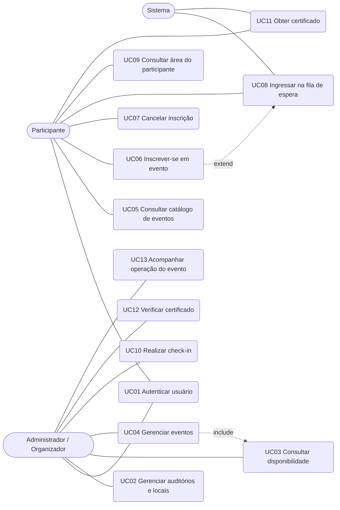

# Especificação de Requisitos de Software
## Sistema de Gestão de Eventos e Auditórios

**Documento de Requisitos** • Contexto, Requisitos Funcionais, Casos de Uso e Rastreabilidade

| Campo | Conteúdo |
|---|---|
| Identificador | SRS-GEA-001 |
| Projeto | Sistema de Gestão de Eventos e Auditórios |
| Versão | 1.0 |
| Data | 13/set/2026 |
| Status | Elaborado para a tarefa da squad |
| Fonte principal | Visão e Escopo — Sistema de Gestão de Eventos e Auditórios |
| Template | MackLEAPS – Software Requirements Specification (RUP/IEEE 830) |

**MACKLEAPS** — Laboratório de Estudos em Ambiente de Produção de Software
FCI – Faculdade de Computação e Informática
UPM – Universidade Presbiteriana Mackenzie

### Equipe da Squad

| Nome | RA |
|---|---|
| Henrique Gomes | 10419795 |
| Matheus Henrique | 10723871 |
| Matheus Romano | 10723806 |
| Luis Patrocínio | 10730958 |
| Sabrina Miyasaki | 10723723 |

### Histórico da Revisão

| Data | Versão | Descrição | Autor |
|---|---|---|---|
| 13/set/2026 | 1.0 | Elaboração inicial do documento de requisitos com base no documento de Visão e Escopo, incluindo contexto, requisitos funcionais, casos de uso e matriz de rastreabilidade. | Henrique Gomes (10419795); Matheus Henrique (10723871); Matheus Romano (10723806); Luis Patrocínio (10730958); Sabrina Miyasaki (10723723) |

---

## Tabela de Conteúdo

1. [Introdução](#1-introdução)
   - 1.1 Finalidade
   - 1.2 Escopo
   - 1.3 Definições, acrônimos e abreviações
   - 1.4 Referências
   - 1.5 Visão geral do documento
2. [Contexto do Projeto](#2-contexto-do-projeto)
   - 2.1 Problema e motivação
   - 2.2 Declaração de visão
   - 2.3 Objetivos
   - 2.4 Perfis de usuário
   - 2.5 Perspectiva do produto
   - 2.6 Escopo funcional e itens fora de escopo
   - 2.7 Regras de negócio essenciais
   - 2.8 Premissas, dependências e restrições
3. [Requisitos Funcionais](#3-requisitos-funcionais)
   - 3.1 Organização dos requisitos
   - 3.2 Especificação dos requisitos funcionais (RF01 a RF11)
4. [Casos de Uso](#4-casos-de-uso)
   - 4.1 Atores
   - 4.2 Diagrama de casos de uso
   - 4.3 Descrição dos casos de uso
   - 4.4 Wireframes da interface
5. [Rastreabilidade](#5-rastreabilidade)
   - 5.1 Relação entre requisitos funcionais e casos de uso
   - 5.2 Matriz RF × UC
   - 5.3 Cobertura dos fluxos mínimos do documento de visão

---

## 1. Introdução

### 1.1 Finalidade

Este documento apresenta a Especificação de Requisitos de Software (SRS) do Sistema de Gestão de Eventos e Auditórios. O objetivo é descrever o comportamento externo da solução de forma suficiente para orientar análise, projeto, implementação e testes, preservando os fluxos funcionais e as regras de negócio essenciais definidos no documento de Visão e Escopo.

Em atendimento à tarefa da squad, o documento concentra-se em quatro entregas: contexto do projeto, requisitos funcionais, casos de uso (diagrama e descrição) e rastreabilidade entre requisitos funcionais e casos de uso.

### 1.2 Escopo

A SRS aplica-se ao ciclo operacional de eventos acadêmicos: cadastro e reserva de auditórios, criação e gestão de eventos, inscrição de participantes, fila de espera, controle de presença e emissão de certificados. A forma de implementação e as plataformas de disponibilização permanecem em aberto, desde que os requisitos e as regras aqui especificados sejam preservados.

### 1.3 Definições, acrônimos e abreviações

| Termo | Definição |
|---|---|
| SRS | Software Requirements Specification — Especificação de Requisitos de Software. |
| RF | Requisito Funcional. |
| UC | Use Case — Caso de Uso. |
| RN | Regra de Negócio. |
| Administrador / Organizador | Perfil responsável por cadastrar locais, criar eventos, realizar check-in e acompanhar a operação. |
| Participante | Perfil que consulta eventos, inscreve-se, realiza check-in e obtém certificados. |
| Auditório / Local | Espaço físico cadastrado para realização de eventos, com capacidade e localização. |
| Subevento | Palestra, sessão ou atividade vinculada a um evento principal. |
| Fila de espera | Lista ordenada de participantes aguardando vaga quando o evento está lotado. |
| Check-in | Registro auditável de presença no evento, preferencialmente por chip do crachá ou QR Code. |
| Certificado | Comprovante de participação emitido somente a quem teve presença registrada, com código único de verificação. |

### 1.4 Referências

- Visão e Escopo do Projeto — Sistema de Gestão de Eventos e Auditórios (documento-base para desenvolvimento).
- MackLEAPS template — Software Requirements Specification (RUP).
- IEEE Std 830-1998 — Recommended Practice for Software Requirements Specifications.
- UML 2.x — Diagrama de Casos de Uso.

### 1.5 Visão geral do documento

A Seção 2 descreve o contexto do projeto. A Seção 3 especifica os requisitos funcionais. A Seção 4 apresenta o diagrama e a descrição dos casos de uso. A Seção 5 registra a rastreabilidade, indicando quais requisitos funcionais originaram quais casos de uso.

---

## 2. Contexto do Projeto

### 2.1 Problema e motivação

Instituições de ensino realizam palestras, seminários, semanas acadêmicas e outros eventos que exigem coordenação de espaços, horários, vagas, inscrições, presença e certificação. Quando essas atividades são tratadas por ferramentas desconectadas ou por procedimentos manuais, a organização tende a enfrentar conflitos de agenda, dificuldade para controlar lotação e filas de espera, registro de presença pouco confiável e maior esforço para emissão de certificados.

O projeto propõe uma solução integrada para apoiar o ciclo operacional de eventos acadêmicos, desde o planejamento do evento e a reserva do auditório até a inscrição dos participantes, o controle de presença e a disponibilização de certificados.

### 2.2 Declaração de visão

Para organizadores e participantes de eventos acadêmicos que precisam administrar espaços, vagas e participação de forma coordenada, o Sistema de Gestão de Eventos e Auditórios é uma plataforma que centraliza a criação de eventos, a alocação de auditórios, as inscrições, o controle de presença e a certificação. Diferentemente de um conjunto de controles manuais ou de ferramentas isoladas, a solução mantém essas atividades relacionadas em um fluxo único e consistente.

### 2.3 Objetivos

- Reduzir o esforço operacional necessário para organizar eventos acadêmicos.
- Evitar conflitos de uso de auditórios e apoiar a escolha de espaços compatíveis com a quantidade esperada de participantes.
- Controlar automaticamente a quantidade de vagas disponíveis e o tratamento de eventos lotados.
- Dar ao participante uma visão clara de suas inscrições e de sua situação em cada evento.
- Registrar a presença dos participantes de forma rápida e auditável.
- Automatizar a emissão de certificados para participantes que efetivamente compareceram ao evento.
- Permitir que organizadores acompanhem informações básicas sobre eventos, inscrições, presença e certificação.

### 2.4 Perfis de usuário

| Perfil | Responsabilidades e necessidades principais |
|---|---|
| Administrador / Organizador | Cadastra e administra auditórios; cria e gerencia eventos; consulta disponibilidade de espaços; acompanha vagas e inscrições; realiza o check-in; acompanha presenças e certificados. |
| Participante | Consulta eventos; realiza e cancela inscrições; acompanha inscrição confirmada ou fila de espera; apresenta sua identificação de check-in; consulta e obtém seus certificados. |

### 2.5 Perspectiva do produto

A solução deve ser entendida como um sistema de apoio à gestão do ciclo de eventos. A forma de implementação é deliberadamente aberta: a equipe poderá decidir como estruturar a aplicação e em quais plataformas disponibilizá-la, desde que os fluxos funcionais e as regras de negócio essenciais descritos neste documento sejam preservados.

### 2.6 Escopo funcional e itens fora de escopo

Estão no escopo as funcionalidades de acesso e perfis, gestão de auditórios, consulta de disponibilidade, gestão de eventos, catálogo, inscrição, fila de espera, área do participante, check-in, certificados e acompanhamento administrativo básico.

Não são obrigatórios, podendo ser tratados apenas como extensões:

- Notificações automáticas por e-mail, SMS ou push.
- Relatórios analíticos avançados, dashboards históricos, gráficos e exportação em múltiplos formatos.
- Portal público automatizado para validação de certificados por terceiros — basta existir mecanismo de conferência do código pela organização.
- Integrações com sistemas acadêmicos.
- Recursos financeiros, venda de ingressos, pagamentos ou cobrança de inscrições.

### 2.7 Regras de negócio essenciais

| ID | Descrição |
|---|---|
| RN01 | Um local não pode receber dois eventos com horários sobrepostos. |
| RN02 | A capacidade de um local deve ser considerada na escolha do espaço para o evento. |
| RN03 | O número de inscrições confirmadas não deve ultrapassar a quantidade de vagas definida para o evento. |
| RN04 | Quando não houver vagas, novas solicitações devem ser encaminhadas para a fila de espera, se ela estiver habilitada. |
| RN05 | A promoção da fila de espera deve respeitar a ordem de entrada. |
| RN06 | Um participante não pode possuir mais de uma inscrição ativa no mesmo evento. |
| RN07 | Somente inscrições confirmadas podem resultar em check-in válido. |
| RN08 | Um check-in já registrado não pode ser contabilizado novamente. |
| RN09 | Somente participantes com presença registrada podem receber certificado. |
| RN10 | Cada certificado deve possuir um identificador único que permita sua conferência posterior. |

### 2.8 Premissas, dependências e restrições

- **Premissa:** usuários possuem identificação institucional, e o chip do crachá do aluno pode ser usado como forma principal de check-in quando disponível.
- **Premissa:** cada inscrição confirmada possui um identificador individual de check-in, apresentado como QR Code ou mecanismo equivalente.
- **Dependência:** o documento de Visão e Escopo é a fonte dos fluxos mínimos (planejamento, inscrição, fila, presença e certificação).
- **Restrição:** operações administrativas ficam restritas a usuários autorizados do perfil Administrador/Organizador.
- **Restrição de design:** a arquitetura e a plataforma não são impostas por esta SRS, desde que os requisitos funcionais e as regras de negócio sejam atendidos.

---

## 3. Requisitos Funcionais

### 3.1 Organização dos requisitos

Os requisitos funcionais foram elaborados com base no documento de Visão e Escopo do projeto e posteriormente analisados com auxílio de IA Generativa e revisados pelo grupo.

| Código | Requisito Funcional |
|---|---|
| RF01 | O sistema deve permitir que usuários acessem o sistema de forma identificada. |
| RF02 | O sistema deve diferenciar os perfis Administrador/Organizador e Participante. |
| RF03 | O sistema deve restringir as operações administrativas aos usuários autorizados. |
| RF04 | O sistema deve permitir ao administrador cadastrar, consultar, alterar e desativar auditórios ou locais. |
| RF05 | O sistema deve permitir registrar a capacidade e a localização dos auditórios. |
| RF06 | O sistema deve permitir registrar indisponibilidades ou bloqueios de agenda dos locais. |
| RF07 | O sistema deve permitir consultar os locais disponíveis para uma determinada data e intervalo de horário. |
| RF08 | O sistema deve considerar a capacidade necessária na consulta de disponibilidade dos locais. |
| RF09 | O sistema deve permitir criar, consultar, alterar e encerrar eventos. |
| RF10 | O sistema deve permitir cadastrar título, descrição, data, horário, local e quantidade de vagas dos eventos. |
| RF11 | O sistema deve permitir organizar um evento principal com subeventos. |
| RF12 | O sistema deve apresentar a situação do evento, como aberto, lotado, encerrado ou realizado. |
| RF13 | O sistema deve permitir aos participantes consultar os eventos disponíveis. |
| RF14 | O sistema deve apresentar aos participantes informações como data, horário, local e situação das vagas. |
| RF15 | O sistema deve permitir que o participante realize inscrição em eventos abertos. |
| RF16 | O sistema deve confirmar a inscrição enquanto houver vagas disponíveis. |
| RF17 | O sistema deve impedir inscrições duplicadas do mesmo participante no mesmo evento. |
| RF18 | O sistema deve permitir o cancelamento da inscrição quando aplicável. |
| RF19 | O sistema deve permitir que participantes ingressem em uma fila de espera quando o evento estiver lotado. |
| RF20 | O sistema deve promover automaticamente participantes da fila quando novas vagas forem liberadas. |
| RF21 | O sistema deve permitir que o participante consulte suas inscrições e respectivas situações. |
| RF22 | O sistema deve disponibilizar um identificador individual para realização do check-in. |
| RF23 | O sistema deve permitir ao administrador validar o identificador de check-in do participante. |
| RF24 | O sistema deve permitir o registro da presença e do horário do check-in. |
| RF25 | O sistema deve informar se o check-in foi aceito ou rejeitado. |
| RF26 | O sistema deve impedir que o mesmo identificador seja utilizado mais de uma vez. |
| RF27 | O sistema deve gerar certificado de participação para participantes que possuam presença registrada. |
| RF28 | O sistema deve incluir no certificado o nome do participante, evento, data e carga horária. |
| RF29 | O sistema deve associar ao certificado um código único de verificação. |
| RF30 | O sistema deve permitir ao participante acessar ou obter seu certificado. |
| RF31 | O sistema deve permitir que a organização confira a validade de um certificado por meio de seu código de verificação. |
| RF32 | O sistema deve permitir ao administrador consultar eventos, inscritos e participantes presentes. |
| RF33 | O sistema deve apresentar informações como vagas, inscritos, pessoas em espera, presenças e certificados emitidos. |
| RF34 | O sistema deve permitir ajustes administrativos necessários ao andamento do evento, como alteração da quantidade de vagas. |

*Tabela 1 — Catálogo dos requisitos funcionais.*

### 3.2 Especificação dos requisitos funcionais (RF01 a RF11)

#### RF01 — Acesso e perfis de usuário

| Campo | Conteúdo |
|---|---|
| Identificador | RF01 |
| Nome | Acesso e perfis de usuário |
| Prioridade | Essencial |
| Descrição | O sistema deve permitir que os usuários acessem a solução de forma identificada, distinguir no mínimo os perfis Administrador/Organizador e Participante, e restringir as operações administrativas aos usuários autorizados. |
| Regras de negócio | — |
| Critério de aceite | Usuário autenticado visualiza apenas as operações do seu perfil; tentativa de operação administrativa por participante é recusada. |

#### RF02 — Cadastro e gestão de auditórios ou locais

| Campo | Conteúdo |
|---|---|
| Identificador | RF02 |
| Nome | Cadastro e gestão de auditórios ou locais |
| Prioridade | Essencial |
| Descrição | O sistema deve permitir ao administrador cadastrar, consultar, alterar e desativar locais utilizados em eventos, registrando no mínimo nome/identificação, capacidade e informações de localização, bem como indisponibilidades ou bloqueios de agenda quando necessário. |
| Regras de negócio | RN01, RN02 |
| Critério de aceite | Local cadastrado fica disponível para consulta e associação a eventos; local desativado ou bloqueado não é oferecido como disponível no período correspondente. |

#### RF03 — Consulta de disponibilidade de locais

| Campo | Conteúdo |
|---|---|
| Identificador | RF03 |
| Nome | Consulta de disponibilidade de locais |
| Prioridade | Essencial |
| Descrição | O sistema deve permitir consultar locais disponíveis para uma data e um intervalo de horário, considerando a capacidade necessária para o público esperado, retornando somente locais compatíveis e informando quando não houver local que atenda aos critérios. |
| Regras de negócio | RN01, RN02 |
| Critério de aceite | A consulta não lista locais com conflito de horário nem locais com capacidade inferior à informada; ausência de resultado é comunicada claramente. |

#### RF04 — Cadastro e gestão de eventos

| Campo | Conteúdo |
|---|---|
| Identificador | RF04 |
| Nome | Cadastro e gestão de eventos |
| Prioridade | Essencial |
| Descrição | O sistema deve permitir criar, consultar, alterar e encerrar eventos, registrando título, descrição, data, horário de início e término, local e quantidade de vagas. Deve permitir evento principal com subeventos, apresentar estado (aberto, lotado, encerrado ou realizado) e impedir associação de eventos ao mesmo local em horários conflitantes. |
| Regras de negócio | RN01, RN02 |
| Critério de aceite | Evento é gravado com os dados obrigatórios e um estado válido; tentativa de conflito de agenda é impedida; subeventos ficam vinculados ao evento principal. |

#### RF05 — Catálogo e consulta de eventos

| Campo | Conteúdo |
|---|---|
| Identificador | RF05 |
| Nome | Catálogo e consulta de eventos |
| Prioridade | Essencial |
| Descrição | O sistema deve apresentar aos participantes os eventos disponíveis, com informações suficientes para decisão de inscrição (data, horário, local e situação das vagas), permitindo acesso aos detalhes do evento e, quando existirem, aos seus subeventos. |
| Regras de negócio | — |
| Critério de aceite | O catálogo exibe os atributos mínimos de decisão e os detalhes incluem subeventos quando houver. |

#### RF06 — Inscrição em eventos

| Campo | Conteúdo |
|---|---|
| Identificador | RF06 |
| Nome | Inscrição em eventos |
| Prioridade | Essencial |
| Descrição | O sistema deve permitir que um participante se inscreva em um evento aberto, confirmando imediatamente a inscrição enquanto houver vagas. Deve impedir inscrições duplicadas do mesmo participante no mesmo evento, impedir novas inscrições em eventos encerrados, fechados ou já realizados, e permitir cancelamento quando aplicável. |
| Regras de negócio | RN03, RN06 |
| Critério de aceite | Com vaga disponível a inscrição é confirmada na hora; duplicidade é recusada; evento não aberto recusa inscrição; cancelamento libera a vaga. |

#### RF07 — Fila de espera

| Campo | Conteúdo |
|---|---|
| Identificador | RF07 |
| Nome | Fila de espera |
| Prioridade | Essencial |
| Descrição | Quando as vagas estiverem esgotadas, o sistema deve permitir que o participante ingresse em uma fila de espera, preservar a ordem de entrada, promover automaticamente participantes quando novas vagas forem liberadas e atualizar a situação de "em espera" para "confirmado" após a promoção. |
| Regras de negócio | RN03, RN04, RN05 |
| Critério de aceite | Evento lotado oferece fila (se habilitada); a promoção ocorre na ordem de chegada; a situação do promovido passa a confirmado. |

#### RF08 — Área do participante

| Campo | Conteúdo |
|---|---|
| Identificador | RF08 |
| Nome | Área do participante |
| Prioridade | Essencial |
| Descrição | O sistema deve permitir que o participante consulte suas inscrições, exiba o estado de cada participação (confirmado, em fila de espera, cancelado ou concluído) e disponibilize, quando cabível, o recurso necessário para o check-in e o acesso aos certificados. |
| Regras de negócio | — |
| Critério de aceite | A área pessoal lista todas as inscrições do participante com o estado atual e atalhos de check-in/certificado quando aplicáveis. |

#### RF09 — Controle de presença / check-in

| Campo | Conteúdo |
|---|---|
| Identificador | RF09 |
| Nome | Controle de presença / check-in |
| Prioridade | Essencial |
| Descrição | O sistema deve disponibilizar, para cada inscrição confirmada, um identificador individual de check-in (QR Code ou equivalente). Quando disponível, o chip identificador do crachá do aluno deve ser a forma principal de check-in. O administrador valida o identificador no momento do evento. O check-in é aceito somente para participante inscrito no evento correspondente, não pode ser reutilizado, registra presença e horário, e informa claramente se foi aceito ou rejeitado. |
| Regras de negócio | RN07, RN08 |
| Critério de aceite | Check-in de inscrito confirmado é aceito uma única vez, com data/hora; identificador reutilizado ou participante não confirmado é rejeitado com mensagem clara. |

#### RF10 — Certificados

| Campo | Conteúdo |
|---|---|
| Identificador | RF10 |
| Nome | Certificados |
| Prioridade | Essencial |
| Descrição | O sistema deve gerar certificado de participação apenas para quem tiver presença registrada, incluindo nome do participante, evento, data e carga horária, associar um código único de verificação, permitir ao participante acessar ou obter o certificado e permitir que a organização confira a validade a partir desse código. |
| Regras de negócio | RN09, RN10 |
| Critério de aceite | Participante sem presença não recebe certificado; certificado gerado contém os dados essenciais e um código único conferível pela organização. |

#### RF11 — Acompanhamento administrativo básico

| Campo | Conteúdo |
|---|---|
| Identificador | RF11 |
| Nome | Acompanhamento administrativo básico |
| Prioridade | Essencial |
| Descrição | O sistema deve permitir ao administrador consultar eventos, inscritos e participantes presentes, apresentar contagens básicas (vagas, inscritos, pessoas em espera, presenças e certificados emitidos) e permitir ajustes administrativos necessários ao andamento do evento, como alteração da quantidade de vagas. |
| Regras de negócio | RN03, RN05 |
| Critério de aceite | Painel administrativo apresenta as contagens do evento; aumento de vagas pode promover automaticamente a fila; as consultas de inscritos e presentes estão disponíveis. |

---

## 4. Casos de Uso

### 4.1 Atores

| Ator | Tipo | Descrição |
|---|---|---|
| Administrador / Organizador | Primário | Planeja espaços e eventos, realiza check-in e acompanha a operação. |
| Participante | Primário | Consulta eventos, inscreve-se, apresenta identificação de presença e obtém certificado. |
| Sistema | Secundário | Executa promoções automáticas da fila de espera e apoia a geração do certificado. |

*Tabela 2 — Atores do modelo de casos de uso.*

### 4.2 Diagrama de casos de uso

A Figura 1 apresenta o diagrama UML de casos de uso da solução. O relacionamento `<<include>>` indica que a gestão de eventos utiliza a consulta de disponibilidade para evitar conflito de agenda. O relacionamento `<<extend>>` indica que a inscrição pode ser estendida pela fila de espera quando não houver vaga. O ator Sistema participa da promoção automática da fila.

*Figura 1 — Diagrama de casos de uso do Sistema de Gestão de Eventos e Auditórios.*

### 4.3 Descrição dos casos de uso

Os casos de uso a seguir utilizam o formato de descrição textual (fluxo básico, alternativos e de exceção), adequado à disciplina de Análise e Desenvolvimento de Sistemas e alinhado ao template MackLEAPS/RUP.

#### UC01 — Autenticar usuário

| Campo | Conteúdo |
|---|---|
| Identificador | UC01 |
| Nome | Autenticar usuário |
| Ator principal | Administrador / Organizador; Participante |
| Atores secundários | — |
| Objetivo | Permitir acesso identificado ao sistema e carregar o perfil e as permissões correspondentes. |
| Pré-condições | O usuário possui credenciais cadastradas. |
| Pós-condições de sucesso | Sessão autenticada com perfil definido; operações administrativas permanecem restritas ao perfil autorizado. |
| Requisitos funcionais | RF01 |
| Regras de negócio | — |

**Fluxo básico**
1. O usuário acessa o sistema.
2. O usuário informa suas credenciais de identificação.
3. O sistema valida as credenciais.
4. O sistema identifica o perfil (Administrador/Organizador ou Participante).
5. O sistema apresenta a interface e as operações permitidas ao perfil.

**Fluxos alternativos**
- Não há fluxo alternativo de sucesso além da escolha de perfil já cadastrado.

**Fluxos de exceção**
- E1 — Credenciais inválidas: o sistema recusa o acesso e informa o motivo, sem revelar dados de outros usuários.
- E2 — Usuário autenticado como Participante tenta operação administrativa: o sistema bloqueia a operação (RF01).

#### UC02 — Gerenciar auditórios e locais

| Campo | Conteúdo |
|---|---|
| Identificador | UC02 |
| Nome | Gerenciar auditórios e locais |
| Ator principal | Administrador / Organizador |
| Atores secundários | — |
| Objetivo | Manter o cadastro dos espaços utilizados em eventos, incluindo capacidade, localização e bloqueios de agenda. |
| Pré-condições | O administrador está autenticado (UC01). |
| Pós-condições de sucesso | O local está cadastrado, atualizado, desativado ou com indisponibilidade registrada, conforme a operação realizada. |
| Requisitos funcionais | RF02 |
| Regras de negócio | RN01, RN02 |

**Fluxo básico**
1. O administrador solicita o cadastro de um local.
2. O administrador informa nome/identificação, capacidade e localização.
3. O sistema valida os dados obrigatórios.
4. O sistema registra o local.
5. O sistema confirma a operação.

**Fluxos alternativos**
- A1 — Consultar locais cadastrados.
- A2 — Alterar dados de um local existente.
- A3 — Desativar um local.
- A4 — Registrar indisponibilidade ou bloqueio de agenda para um período.

**Fluxos de exceção**
- E1 — Dados obrigatórios ausentes ou capacidade inválida: o sistema impede a gravação e solicita correção.

#### UC03 — Consultar disponibilidade de locais

| Campo | Conteúdo |
|---|---|
| Identificador | UC03 |
| Nome | Consultar disponibilidade de locais |
| Ator principal | Administrador / Organizador |
| Atores secundários | — |
| Objetivo | Identificar espaços livres e compatíveis com data, horário e capacidade necessária. |
| Pré-condições | Existem locais cadastrados (UC02). O administrador está autenticado. |
| Pós-condições de sucesso | O administrador obteve a lista de locais compatíveis ou a informação de que não há local disponível. |
| Requisitos funcionais | RF03 |
| Regras de negócio | RN01, RN02 |

**Fluxo básico**
1. O administrador informa data e intervalo de horário.
2. Opcionalmente, informa a capacidade mínima necessária para o público esperado.
3. O sistema pesquisa locais sem conflito de agenda no período (RN01).
4. Quando a capacidade é informada, o sistema descarta locais incompatíveis (RN02).
5. O sistema apresenta somente os locais compatíveis.

**Fluxos alternativos**
- A1 — Nenhum local atende aos critérios: o sistema informa claramente a indisponibilidade.

**Fluxos de exceção**
- E1 — Período inválido (término anterior ao início): o sistema recusa a consulta e solicita correção.

#### UC04 — Gerenciar eventos

| Campo | Conteúdo |
|---|---|
| Identificador | UC04 |
| Nome | Gerenciar eventos |
| Ator principal | Administrador / Organizador |
| Atores secundários | — |
| Objetivo | Criar, consultar, alterar e encerrar eventos, associando local e vagas sem conflito de agenda, inclusive com subeventos. |
| Pré-condições | O administrador está autenticado. Há pelo menos um local cadastrado. Este caso de uso inclui UC03 na escolha do espaço. |
| Pós-condições de sucesso | O evento é persistido com estado válido (aberto, lotado, encerrado ou realizado) e sem conflito de local/horário. |
| Requisitos funcionais | RF04 |
| Regras de negócio | RN01, RN02 |

**Fluxo básico**
1. O administrador solicita a criação de um evento.
2. O administrador informa título, descrição, data, horário de início e término, local e quantidade de vagas.
3. O sistema consulta a disponibilidade do local no período (`<<include>>` UC03).
4. O sistema verifica se a capacidade do local comporta as vagas (RN02).
5. O sistema registra o evento com estado inicial "aberto".
6. O sistema confirma a criação.

**Fluxos alternativos**
- A1 — Consultar eventos existentes.
- A2 — Alterar dados do evento, revalidando conflito e capacidade.
- A3 — Encerrar o evento, impedindo novas inscrições.
- A4 — Organizar subeventos (palestras ou sessões) vinculados ao evento principal.

**Fluxos de exceção**
- E1 — Conflito de horário no local (RN01): o sistema impede a associação e solicita outro local ou horário.
- E2 — Vagas superiores à capacidade do local (RN02): o sistema alerta e impede a gravação até ajuste.

#### UC05 — Consultar catálogo e detalhes de eventos

| Campo | Conteúdo |
|---|---|
| Identificador | UC05 |
| Nome | Consultar catálogo e detalhes de eventos |
| Ator principal | Participante |
| Atores secundários | — |
| Objetivo | Permitir ao participante conhecer os eventos disponíveis e obter informações suficientes para decidir a inscrição. |
| Pré-condições | Existem eventos cadastrados. O participante pode estar autenticado. |
| Pós-condições de sucesso | O participante visualizou a lista de eventos e, se desejado, os detalhes e subeventos de um evento. |
| Requisitos funcionais | RF05 |
| Regras de negócio | — |

**Fluxo básico**
1. O participante acessa o catálogo de eventos.
2. O sistema apresenta os eventos disponíveis com data, horário, local e situação das vagas.
3. O participante seleciona um evento.
4. O sistema exibe os detalhes e, quando existirem, os subeventos vinculados.

**Fluxos alternativos**
- A1 — Não há eventos disponíveis: o sistema apresenta estado vazio correspondente.

**Fluxos de exceção**
- E1 — Evento selecionado deixou de estar disponível: o sistema informa a nova situação.

#### UC06 — Inscrever-se em evento

| Campo | Conteúdo |
|---|---|
| Identificador | UC06 |
| Nome | Inscrever-se em evento |
| Ator principal | Participante |
| Atores secundários | Sistema |
| Objetivo | Confirmar a participação em um evento aberto enquanto houver vaga, sem duplicidade. |
| Pré-condições | O participante está autenticado (UC01) e selecionou um evento aberto (UC05). |
| Pós-condições de sucesso | A inscrição é confirmada e o evento passa a constar na área do participante; o contador de vagas é atualizado. |
| Requisitos funcionais | RF06, RF07 |
| Regras de negócio | RN03, RN04, RN06 |

**Fluxo básico**
1. O participante solicita inscrição no evento aberto.
2. O sistema verifica se o participante já possui inscrição ativa no mesmo evento (RN06).
3. O sistema verifica se há vagas disponíveis (RN03).
4. O sistema confirma imediatamente a inscrição.
5. O sistema atualiza a quantidade de vagas e, se esgotadas, altera o estado do evento para "lotado".
6. O sistema disponibiliza o evento na área do participante.

**Fluxos alternativos**
- A1 — Evento lotado e fila habilitada: o fluxo é estendido por UC08 (`<<extend>>`), encaminhando o participante à fila (RN04).

**Fluxos de exceção**
- E1 — Evento encerrado, fechado ou realizado: o sistema impede a inscrição.
- E2 — Participante já possui inscrição ativa no evento (RN06): o sistema impede duplicidade.
- E3 — Evento lotado e fila não habilitada: o sistema recusa a inscrição e informa a indisponibilidade.

#### UC07 — Cancelar inscrição

| Campo | Conteúdo |
|---|---|
| Identificador | UC07 |
| Nome | Cancelar inscrição |
| Ator principal | Participante |
| Atores secundários | Sistema |
| Objetivo | Permitir o cancelamento da inscrição quando aplicável, liberando vaga e acionando a promoção da fila. |
| Pré-condições | O participante está autenticado e possui inscrição ativa (confirmada ou em espera) no evento. |
| Pós-condições de sucesso | A inscrição assume estado "cancelado". Se era confirmada, uma vaga é liberada e o Sistema pode promover o próximo da fila (UC08). |
| Requisitos funcionais | RF06, RF07 |
| Regras de negócio | RN03, RN05 |

**Fluxo básico**
1. O participante solicita o cancelamento da inscrição.
2. O sistema verifica se o cancelamento é aplicável ao estado atual do evento e da inscrição.
3. O sistema altera a inscrição para "cancelado".
4. Se a inscrição era confirmada, o sistema libera a vaga.
5. Se existir fila de espera, o sistema aciona a promoção automática (UC08 / RN05).

**Fluxos alternativos**
- A1 — Cancelamento de inscrição que estava apenas em espera: o participante é removido da fila, sem alterar o número de confirmados.

**Fluxos de exceção**
- E1 — Cancelamento não aplicável (evento já realizado ou política do organizador): o sistema informa e mantém a inscrição.

#### UC08 — Ingressar na fila de espera

| Campo | Conteúdo |
|---|---|
| Identificador | UC08 |
| Nome | Ingressar na fila de espera |
| Ator principal | Participante |
| Atores secundários | Sistema |
| Objetivo | Registrar o participante na fila quando o evento estiver lotado e promover automaticamente a próxima pessoa elegível ao surgir vaga, respeitando a ordem de entrada. |
| Pré-condições | O evento está lotado e a fila de espera está habilitada. O participante não possui inscrição ativa no evento. |
| Pós-condições de sucesso | O participante permanece "em espera" ou, após promoção, passa a "confirmado". A ordem da fila é preservada. |
| Requisitos funcionais | RF07 |
| Regras de negócio | RN04, RN05, RN03 |

**Fluxo básico**
1. O participante solicita ingresso na fila de um evento lotado.
2. O sistema registra a solicitação na ordem de entrada (RN05).
3. O sistema define a situação da participação como "em espera".
4. O sistema confirma o registro na área do participante.

**Fluxos alternativos**
- A1 — Promoção automática (ator Sistema): uma vaga é liberada (cancelamento ou aumento de vagas).
  - A1.1 O sistema seleciona o primeiro participante elegível da fila (RN05).
  - A1.2 O sistema altera a situação de "em espera" para "confirmado".
  - A1.3 O sistema atualiza vagas e, se ainda houver espera e vagas, repete a promoção.

**Fluxos de exceção**
- E1 — Fila não habilitada: o sistema não permite ingresso e informa o participante.
- E2 — Participante já está na fila ou já confirmado: o sistema impede duplicidade (RN06).

#### UC09 — Consultar área do participante

| Campo | Conteúdo |
|---|---|
| Identificador | UC09 |
| Nome | Consultar área do participante |
| Ator principal | Participante |
| Atores secundários | — |
| Objetivo | Oferecer visão consolidada das inscrições, da situação em cada evento e dos recursos de check-in e certificado. |
| Pré-condições | O participante está autenticado. |
| Pós-condições de sucesso | O participante visualiza suas inscrições e os atalhos cabíveis para check-in e certificados. |
| Requisitos funcionais | RF08 |
| Regras de negócio | — |

**Fluxo básico**
1. O participante acessa sua área pessoal.
2. O sistema lista as inscrições do participante.
3. O sistema exibe o estado de cada participação: confirmado, em fila de espera, cancelado ou concluído.
4. Quando cabível, o sistema disponibiliza o identificador de check-in e o acesso aos certificados.

**Fluxos alternativos**
- A1 — Participante sem inscrições: o sistema apresenta estado vazio e atalho para o catálogo (UC05).

**Fluxos de exceção**
- E1 — Falha ao carregar as inscrições: o sistema informa a indisponibilidade temporária.

#### UC10 — Realizar check-in

| Campo | Conteúdo |
|---|---|
| Identificador | UC10 |
| Nome | Realizar check-in |
| Ator principal | Administrador / Organizador |
| Atores secundários | Participante |
| Objetivo | Registrar de forma rápida e auditável a presença do participante inscrito e confirmado no evento correspondente. |
| Pré-condições | O evento está no período apropriado de realização. O participante possui inscrição confirmada e identificador de check-in. Preferencialmente, utiliza-se o chip do crachá do aluno quando disponível. |
| Pós-condições de sucesso | A presença e o horário do check-in são registrados, ou a tentativa é rejeitada com motivo claro. |
| Requisitos funcionais | RF09 |
| Regras de negócio | RN07, RN08 |

**Fluxo básico**
1. O participante apresenta seu identificador individual (chip do crachá, QR Code ou equivalente).
2. O administrador valida o identificador no momento do evento.
3. O sistema verifica se existe inscrição confirmada no evento correspondente (RN07).
4. O sistema verifica se o identificador ainda não foi utilizado (RN08).
5. O sistema registra a presença e o horário do check-in.
6. O sistema informa que o check-in foi aceito.

**Fluxos alternativos**
- A1 — Uso do chip do crachá como forma principal, quando o dispositivo/identificador estiver disponível.

**Fluxos de exceção**
- E1 — Participante não inscrito ou inscrição não confirmada: o sistema rejeita o check-in (RN07).
- E2 — Identificador já utilizado: o sistema rejeita a reutilização (RN08).
- E3 — Identificador de outro evento: o sistema rejeita e informa o motivo.

#### UC11 — Obter certificado

| Campo | Conteúdo |
|---|---|
| Identificador | UC11 |
| Nome | Obter certificado |
| Ator principal | Participante |
| Atores secundários | Sistema |
| Objetivo | Disponibilizar certificado de participação apenas a quem teve presença registrada, com dados essenciais e código único. |
| Pré-condições | O evento ocorreu. O participante está autenticado e possui presença registrada (UC10). |
| Pós-condições de sucesso | O certificado é gerado ou recuperado, contendo nome, evento, data, carga horária e código único de verificação. |
| Requisitos funcionais | RF10 |
| Regras de negócio | RN09, RN10 |

**Fluxo básico**
1. O participante solicita o certificado na área pessoal.
2. O sistema verifica a presença registrada (RN09).
3. O sistema gera o certificado com nome do participante, evento, data e carga horária.
4. O sistema associa um código único de verificação (RN10).
5. O sistema disponibiliza o certificado ao participante.

**Fluxos alternativos**
- A1 — Certificado já gerado: o sistema reapresenta o mesmo documento e o mesmo código.

**Fluxos de exceção**
- E1 — Ausência de presença registrada: o sistema não emite o certificado e informa a regra RN09.

#### UC12 — Verificar autenticidade de certificado

| Campo | Conteúdo |
|---|---|
| Identificador | UC12 |
| Nome | Verificar autenticidade de certificado |
| Ator principal | Administrador / Organizador |
| Atores secundários | — |
| Objetivo | Permitir que a organização confira a validade de um certificado a partir do código de verificação. |
| Pré-condições | Existe um código de certificado informado pela parte interessada. Não é exigido portal público para terceiros. |
| Pós-condições de sucesso | A organização obtém a confirmação de validade e os dados do certificado, ou a informação de código inexistente/inválido. |
| Requisitos funcionais | RF10 |
| Regras de negócio | RN10 |

**Fluxo básico**
1. O administrador informa o código único de verificação.
2. O sistema localiza o certificado correspondente.
3. O sistema apresenta os dados essenciais para conferência (participante, evento, data e carga horária).
4. O sistema indica que o certificado é válido.

**Fluxos alternativos**
- —

**Fluxos de exceção**
- E1 — Código inexistente ou não reconhecido: o sistema informa que o certificado não pôde ser confirmado.

#### UC13 — Acompanhar operação do evento

| Campo | Conteúdo |
|---|---|
| Identificador | UC13 |
| Nome | Acompanhar operação do evento |
| Ator principal | Administrador / Organizador |
| Atores secundários | Sistema |
| Objetivo | Oferecer consulta operacional de eventos, inscritos e presentes, com contagens básicas e ajuste de vagas. |
| Pré-condições | O administrador está autenticado. O evento está cadastrado. |
| Pós-condições de sucesso | O administrador visualiza as contagens e, se alterar vagas, o sistema atualiza a ocupação e pode promover a fila. |
| Requisitos funcionais | RF11 |
| Regras de negócio | RN03, RN05 |

**Fluxo básico**
1. O administrador seleciona um evento.
2. O sistema apresenta inscritos e participantes presentes.
3. O sistema exibe contagens de vagas, inscritos, pessoas em espera, presenças e certificados emitidos.
4. O administrador consulta as informações para conduzir a operação.

**Fluxos alternativos**
- A1 — Ajuste da quantidade de vagas.
  - A1.1 Se as vagas aumentarem e houver fila, o Sistema promove participantes na ordem de entrada (UC08 / RN05), sem ultrapassar o novo limite (RN03).

**Fluxos de exceção**
- E1 — Tentativa de reduzir vagas abaixo do número de inscrições confirmadas: o sistema impede o ajuste (RN03).
- E2 — Evento inexistente ou sem permissão: o sistema recusa a consulta.

### 4.4 Wireframes da interface

Os wireframes representam a interface em baixa fidelidade do Sistema de Gestão de Eventos e Auditórios. Eles não definem tecnologia de implementação; apenas materializam os casos de uso em telas, preservando os fluxos e as regras de negócio do documento de Visão e Escopo.

> As imagens originais dos wireframes (WF00–WF08) estão no PDF fonte e não são reproduzidas neste Markdown. Recomenda-se anexá-las como arquivos separados (ex.: `docs/wireframes/wf01-autenticacao.png`) e referenciá-las aqui com ``.

| Wireframe | Tela | Casos de uso | Função na interface |
|---|---|---|---|
| WF00 | Mapa de telas | UC01–UC13 | Visão geral do fluxo entre as telas e cobertura dos fluxos A–E. |
| WF01 | Autenticação | UC01 | Login identificado e restrição por perfil. |
| WF02 | Locais | UC02 | CRUD de auditórios, capacidade, localização e bloqueios. |
| WF03 | Disponibilidade e evento | UC03, UC04 | Busca de espaço compatível e cadastro do evento. |
| WF04 | Catálogo e inscrição | UC05, UC06, UC08 | Consulta, inscrição confirmada e fila de espera. |
| WF05 | Área do participante | UC07, UC08, UC09 | Inscrições, estados, QR e cancelamento. |
| WF06 | Check-in | UC10 | Validação de presença por crachá ou QR Code. |
| WF07 | Certificados | UC11, UC12 | Obtenção pelo participante e verificação pela organização. |
| WF08 | Painel administrativo | UC13 | Contagens, presentes e ajuste de vagas. |

*Tabela 6 — Rastreabilidade entre wireframes e casos de uso.*

**Correspondência com os fluxos mínimos do documento de visão**
- Fluxo A — Planejamento: Locais → Disponibilidade → Eventos
- Fluxo B — Inscrição com vaga: Catálogo → Inscrição → Área do participante
- Fluxo C — Fila de espera: Catálogo (lotado) → Fila → promoção automática na Área do participante
- Fluxo D — Presença: Área do participante (QR/crachá) → Check-in do administrador
- Fluxo E — Certificação: Obter certificado → Verificar autenticidade

---

## 5. Rastreabilidade

### 5.1 Relação entre requisitos funcionais e casos de uso

Cada requisito funcional do catálogo originou um ou mais casos de uso. A tabela a seguir registra a rastreabilidade de origem (qual RF gerou quais UC), distinguindo o caso de uso principal daqueles que apenas consomem o requisito em um fluxo específico.

| Requisito funcional | Casos de uso gerados | Justificativa da derivação |
|---|---|---|
| RF01 — Acesso e perfis | UC01 | O requisito de acesso identificado e distinção de perfis é realizado integralmente pela autenticação. |
| RF02 — Gestão de locais | UC02 | Cadastro, consulta, alteração, desativação e bloqueio de agenda concentram-se na gestão de auditórios. |
| RF03 — Disponibilidade | UC03 (principal); UC04 (inclui) | A consulta avulsa de espaços gera UC03. A criação de evento inclui essa consulta para cumprir RN01/RN02. |
| RF04 — Gestão de eventos | UC04 | Criação, alteração, encerramento, estados e subeventos são o núcleo de UC04. |
| RF05 — Catálogo | UC05 | A apresentação de eventos e detalhes ao participante origina o catálogo. |
| RF06 — Inscrição | UC06 (principal); UC07 | Confirmação de vaga e impedimentos geram UC06. O cancelamento previsto no mesmo RF gera UC07. |
| RF07 — Fila de espera | UC08 (principal); UC06 (estende); UC07; UC13 | A entrada e a promoção da fila geram UC08. UC06 encaminha à fila; UC07 e UC13 disparam promoção ao liberar ou aumentar vagas. |
| RF08 — Área do participante | UC09 | Consulta de inscrições, estados, check-in e certificados na visão do participante geram UC09. |
| RF09 — Check-in | UC10 | Identificador, validação, rejeições e registro de presença/horário geram UC10. |
| RF10 — Certificados | UC11 (emissão); UC12 (verificação) | A geração/obtenção pelo participante gera UC11. A conferência do código pela organização gera UC12. |
| RF11 — Acompanhamento admin. | UC13 | Consultas, contagens e ajuste de vagas geram o acompanhamento operacional. |

*Tabela 3 — Rastreabilidade de origem: quais RF geraram quais UC.*

### 5.2 Matriz RF × UC

Na matriz, "P" indica caso de uso principal derivado do requisito e "X" indica participação secundária (include, extend ou disparo de regra).

| RF | UC01 | UC02 | UC03 | UC04 | UC05 | UC06 | UC07 | UC08 | UC09 | UC10 | UC11 | UC12 | UC13 |
|---|---|---|---|---|---|---|---|---|---|---|---|---|---|
| RF01 | P | | | | | | | | | | | | |
| RF02 | | P | | | | | | | | | | | |
| RF03 | | | P | X | | | | | | | | | |
| RF04 | | | | P | | | | | | | | | |
| RF05 | | | | | P | | | | | | | | |
| RF06 | | | | | | P | P | | | | | | |
| RF07 | | | | | | X | X | P | | | | | X |
| RF08 | | | | | | | | | P | | | | |
| RF09 | | | | | | | | | | P | | | |
| RF10 | | | | | | | | | | | P | P | |
| RF11 | | | | | | | | | | | | | P |

*Tabela 4 — Matriz de rastreabilidade RF × UC (P = principal; X = secundário).*

### 5.3 Cobertura dos fluxos mínimos do documento de visão

| Fluxo mínimo (Visão e Escopo) | Casos de uso que o realizam | Requisitos cobertos |
|---|---|---|
| A — Planejamento de evento (cadastrar local, consultar disponibilidade, criar evento sem conflito) | UC02, UC03, UC04 | RF02, RF03, RF04 |
| B — Inscrição com vaga (catálogo, inscrição confirmada, área pessoal) | UC05, UC06, UC09 | RF05, RF06, RF08 |
| C — Evento lotado e fila de espera (ingresso e promoção automática) | UC06, UC07, UC08, UC13 | RF06, RF07, RF11 |
| D — Presença (identificador, validação e registro, com rejeição de reuso) | UC10 | RF09 |
| E — Certificação (emissão com código único e conferência pela organização) | UC11, UC12 | RF10 |

*Tabela 5 — Cobertura dos fluxos mínimos A a E.*

A matriz e as tabelas de origem demonstram cobertura completa dos requisitos funcionais F01–F11 / RF01–RF11 por pelo menos um caso de uso, e cobertura dos cinco fluxos mínimos exigidos pelo documento de Visão e Escopo.
